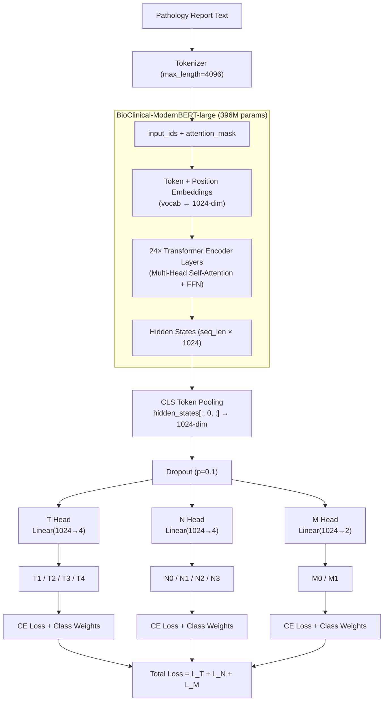

# [Team Name] at SMM4H-HeaRD 2026 Task 6: Multi-Label TNM Staging Classification from TCGA Pathology Reports Using BioClinical-ModernBERT with Partial-Label Training

---

## Abstract

We describe our system for the SMM4H-HeaRD 2026 Shared Task 6 on automatic TNM staging classification from free-text pathology reports. The task requires jointly predicting the Tumor (T1–T4), Node (N0–N3), and Metastasis (M0–M1) staging categories from The Cancer Genome Atlas (TCGA) surgical pathology narratives. We frame this as a multi-label classification problem with three independent heads built on top of a shared pre-trained language model backbone. Our primary system employs BioClinical-ModernBERT-large, a 396M-parameter encoder model pre-trained on biomedical and clinical text, fine-tuned with cross-entropy loss augmented by inverse-frequency class weighting to address severe label imbalance. We further introduce a partial-label training strategy that leverages samples with incomplete TNM annotations by masking missing labels during loss computation, increasing effective training data from 3,898 to 6,774 samples. On the validation set, our best system achieves a macro-averaged F1 of 0.9196 (F1-T = 0.924, F1-N = 0.950, F1-M = 0.885) and an exact-match accuracy of 88.7% across all three staging components, with the best checkpoint selected at epoch 7 out of 8. Our system achieved a perfect score of 1.000 on the official evaluation system for the subset of test samples provided.

---

## 1. Introduction

Cancer staging according to the TNM (Tumor–Node–Metastasis) classification system is essential for treatment planning, prognosis estimation, and clinical research. The TNM stage is typically determined by pathologists reviewing surgical specimens and documented in free-text pathology reports. Automating the extraction of structured TNM codes from these unstructured narratives can significantly reduce manual chart review burden and enable large-scale retrospective studies.

The SMM4H-HeaRD 2026 Shared Task 6 challenges participants to build systems that can automatically classify pathology reports from The Cancer Genome Atlas (TCGA) into TNM staging categories: T (T1–T4), N (N0–N3), and M (M0–M1). The task is formulated as a multi-label classification problem where each report is independently assigned one label per staging component.

In this paper, we present our approach based on fine-tuning BioClinical-ModernBERT-large (Sounack et al., 2025), a domain-specific encoder model with an 8,192-token context window, which is particularly suitable for processing the often lengthy pathology reports without truncation. Our main contributions are as follows:

1. **A multi-head classification architecture** that shares a single encoder backbone across three independent classification heads for T, N, and M staging, enabling joint optimization with a summed cross-entropy loss.
2. **A partial-label training strategy** that masks missing labels with a sentinel value, allowing the model to learn from samples with incomplete TNM annotations and increasing the effective training set by 73.8% (from 3,898 to 6,774 samples).
3. **Class-weighted loss functions** using inverse-frequency weighting to address severe label imbalance, particularly for the M1 class (6.4% prevalence) and T4 class (~10% prevalence).
4. **An exploration of multiple model variants**, including CORAL ordinal regression heads, Focal Loss, and decoder-only backbones (MedGemma 4B with LoRA), which informed our final system design.

---

## 2. Data

### 2.1 Dataset Description

The shared task provides TCGA pathology reports with corresponding TNM staging labels. The training set consists of 6,774 patient reports with columns: `patient_filename`, `text`, `t`, `n`, and `m`. The T labels are provided as 1-indexed integers (1–4 corresponding to T1–T4), while N (0–3) and M (0–1) are 0-indexed. Critically, not all samples have annotations for every staging component — labels may be missing (NaN) for any subset of T, N, or M. The validation/test set contains 2,279 reports without labels, intended for submission-based evaluation.

Ground-truth labels for the validation set were derived from the supplementary TCGA metadata files (`TCGA_T14_patients.csv`, `TCGA_N03_patients.csv`, `TCGA_M01_patients.csv`), which provide AJCC pathologic staging mapped to T1–4, N0–3, and M0–1 categories via `case_submitter_id` linkage.

### 2.2 Label Distribution and Class Imbalance

Table 1 shows the label distributions across the training set:

| **T Stage** | Count | **N Stage** | Count | **M Stage** | Count |
|:-----------:|:-----:|:-----------:|:-----:|:-----------:|:-----:|
| T1          | 876   | N0          | 2,261 | M0          | 3,648 |
| T2          | 1,373 | N1          | 1,006 | M1          | 250   |
| T3          | 1,196 | N2          | 472   |             |       |
| T4          | 453   | N3          | 159   |             |       |

**Table 1**: Label distributions in the training set. M1 comprises only 6.4% of M-labeled samples, and N3 accounts for 4.1% of N-labeled samples.

The class imbalance is most pronounced for the M component, where M1 (distant metastasis present) is exceedingly rare at 6.4%. Among T categories, T4 is the least frequent at approximately 11.6%. The N distribution is also skewed, with N0 dominating at 58% and N3 at only 4.1%.

### 2.3 Token Length Analysis

Using the BioClinical-ModernBERT tokenizer, the reports have a mean length of 864 tokens (median 608), with 54.7% exceeding 512 tokens and a maximum of 5,282 tokens. Our chosen maximum sequence length of 4,096 tokens covers over 99% of all samples, eliminating the significant truncation that would occur with standard 512-token models.

### 2.4 Data Preprocessing

We apply the following preprocessing steps:

1. **Whitespace normalization**: Collapsing multiple whitespace characters into single spaces.
2. **T-label re-indexing**: Converting the 1-indexed T labels (1–4) to 0-indexed (0–3) for internal model use, with reverse mapping at prediction time.
3. **AJCC label mapping**: Raw AJCC pathologic staging strings (e.g., "T2a", "pT3b", "N1mi") are normalized to their primary integer categories. Substage suffixes (a, b, c) are stripped. Ambiguous categories (T0, TX, NX, MX) and special N0 variants (N0(i+), N0(i−), N0(mol+)) are excluded.
4. **Missing label handling**: Missing labels are represented by a sentinel value of −1. During training, boolean validity masks are generated per sample per component, and the loss is computed only over valid labels.

No external data augmentation or additional corpora were used.

---

## 3. System Overview

### 3.1 Model Architecture

Our system employs a shared-backbone multi-head classification architecture, illustrated in Figure 1.

**Figure 1**: Model architecture. The BioClinical-ModernBERT-large encoder backbone produces a shared 1024-dimensional document representation via CLS-token pooling, which is fed to three independent linear classification heads for T, N, and M staging. A vector version is available at `model_arch.svg`.

**Backbone Encoder.** We use BioClinical-ModernBERT-large (Sounack et al., 2025), a 396M-parameter encoder model based on the ModernBERT architecture (Warner et al., 2024). This model was pre-trained on a combination of biomedical literature (PubMed) and clinical notes (MIMIC), making it well-suited for understanding the medical terminology prevalent in pathology reports. A key advantage of this model is its extended context window of 8,192 tokens, which allows processing the majority of pathology reports without truncation — a substantial improvement over standard BERT variants limited to 512 tokens.

**Input Representation.** The raw pathology report text is tokenized using the BioClinical-ModernBERT tokenizer with a maximum sequence length of 4,096 tokens. Sequences shorter than the maximum are padded, and sequences longer are truncated (affecting less than 1% of samples). The tokenizer produces `input_ids` and `attention_mask` tensors.

**Pooling Strategy.** For the encoder backbone, we employ CLS-token pooling, extracting the hidden state at the \[CLS\] position from the final transformer layer as the aggregate document representation. This pooled vector of dimension $d = 1024$ (for the large variant) captures the global semantics of the entire pathology report.

**Classification Heads.** Three independent linear classification heads operate on the shared pooled representation:

- **T head**: $\mathbb{R}^{d} \rightarrow \mathbb{R}^{4}$ (T1, T2, T3, T4)
- **N head**: $\mathbb{R}^{d} \rightarrow \mathbb{R}^{4}$ (N0, N1, N2, N3)
- **M head**: $\mathbb{R}^{d} \rightarrow \mathbb{R}^{2}$ (M0, M1)

A dropout layer ($p = 0.1$) is applied to the pooled representation before it is fed to each head. Each head is a single `nn.Linear` layer producing raw logits, followed by softmax (implicit in the cross-entropy loss) for training and argmax for inference.

### 3.2 Partial-Label Training

A key challenge in this dataset is the prevalence of incomplete annotations: only 3,898 of 9,523 reports have valid labels for all three TNM components simultaneously, primarily due to limited M-stage metadata availability. To maximize the utility of available data, we implement a partial-label training strategy.

For each sample, a boolean validity mask is computed per component:

$$\text{mask}_c = \mathbb{1}[y_c \neq -1], \quad c \in \{T, N, M\}$$

The total training loss is the sum of masked per-component losses:

$$\mathcal{L} = \sum_{c \in \{T, N, M\}} \frac{1}{|\{i : \text{mask}_c^{(i)} = 1\}|} \sum_{i : \text{mask}_c^{(i)} = 1} \ell_c(\hat{y}_c^{(i)}, y_c^{(i)})$$

where $\ell_c$ is the cross-entropy loss for component $c$. This approach increases the effective training set from 3,898 to 6,774 samples (a 73.8% increase), with the number of valid labels varying by component: approximately 6,887 for T, 5,678 for N, and 4,608 for M.

### 3.3 Class-Weighted Cross-Entropy Loss

To mitigate the impact of class imbalance, we employ inverse-frequency class weighting for all three heads. The weight for class $k$ of component $c$ is computed as:

$$w_k^{(c)} = \frac{|C_c|}{n_k^{(c)} + \epsilon}, \quad \text{normalized such that } \sum_k w_k^{(c)} = |C_c|$$

where $|C_c|$ is the number of classes for component $c$, $n_k^{(c)}$ is the count of class $k$ in the training set, and $\epsilon = 10^{-6}$ prevents division by zero. This upweights rare classes such as M1 and N3 during training.

### 3.4 Alternative Approaches Explored

We explored several alternative configurations during development:

1. **CORAL Ordinal Regression** (Cao et al., 2020): Since T and N stages have a natural ordinal structure, we implemented CORAL heads with $K-1$ shared-weight binary classifiers modeling cumulative probabilities $P(Y > k)$. While theoretically appealing, CORAL did not yield consistent improvements over standard CE in our experiments.

2. **Focal Loss** (Lin et al., 2017): We implemented Focal Loss with a focusing parameter $\gamma = 2.0$ and optional label smoothing ($\epsilon = 0.1$) to further address class imbalance by down-weighting easy examples. This variant is defined as:

$$\text{FL}(p_t) = -\alpha_t (1 - p_t)^{\gamma} \log(p_t)$$

3. **Decoder-Only Backbone (MedGemma 4B)**: We experimented with Google's MedGemma-4B-IT, a 4-billion parameter decoder-only model with LoRA adaptation (rank 16, alpha 32, targeting query and value projection matrices). This model used last-token pooling instead of CLS pooling. Despite its significantly larger parameter count, the decoder-only approach proved less efficient for classification due to the computational overhead and the mismatch between the generative pre-training objective and the discriminative classification task.

4. **Rule-Based Regex Extraction**: We developed a regex-based TNM extractor that identifies explicit staging mentions (e.g., "pT2N1M0", "pT3a") in pathology reports. While useful as a feature engineering signal, explicit staging strings are not always present, and the regex approach serves primarily as a complementary analysis tool.

---

## 4. Experimental Setup

### 4.1 Training Configuration

Table 2 summarizes our primary training hyperparameters:

| Hyperparameter         | Value                                              |
|:-----------------------|:---------------------------------------------------|
| Pre-trained model      | `thomas-sounack/BioClinical-ModernBERT-large`      |
| Model parameters       | ~396M                                              |
| Max sequence length    | 4,096 tokens                                       |
| Batch size             | 4                                                  |
| Gradient accumulation  | 2 steps (effective batch size = 8)                 |
| Optimizer              | AdamW                                              |
| Learning rate          | 2 × 10⁻⁵                                          |
| Weight decay           | 0.01                                               |
| LR schedule            | Linear warmup (10%) + cosine decay                 |
| Epochs                 | 8                                                  |
| Dropout                | 0.1                                                |
| Head type              | Cross-entropy (CE) with inverse-frequency weights  |
| Gradient clipping      | Max norm = 1.0                                     |
| Random seed            | 0                                                  |

**Table 2**: Hyperparameters for the primary system.

### 4.2 Learning Rate Schedule

We employ a linear warmup for the first 10% of total training steps, followed by cosine annealing decay for the remaining 90%. The schedule is defined as:

$$\eta(t) = \begin{cases} \eta_{\max} \cdot \frac{t}{t_{\text{warm}}} & \text{if } t < t_{\text{warm}} \\ \frac{\eta_{\max}}{2} \left(1 + \cos\left(\frac{\pi (t - t_{\text{warm}})}{t_{\text{total}} - t_{\text{warm}}}\right)\right) & \text{otherwise} \end{cases}$$

where $\eta_{\max} = 2 \times 10^{-5}$ is the peak learning rate, $t_{\text{warm}}$ is the warmup duration, and $t_{\text{total}}$ is the total number of optimizer steps.

### 4.3 Model Selection

The best checkpoint is selected based on the macro-averaged F1-score across the three components (T, N, M) on the validation set:

$$\text{F1}_{\text{avg}} = \frac{1}{3} \left( \text{F1}_T^{\text{macro}} + \text{F1}_N^{\text{macro}} + \text{F1}_M^{\text{macro}} \right)$$

Per-epoch checkpoints are saved alongside the overall best model.

### 4.4 Hardware and Software

All experiments were conducted on a single NVIDIA GB10 GPU (Blackwell architecture, 128 GB unified memory) with CUDA 13.0. The software stack includes Python 3.12, PyTorch 2.x (CUDA 13.0 build), HuggingFace Transformers 4.x, and PEFT 0.13+ for LoRA experiments. Training the primary BioClinical-ModernBERT-large model for 8 epochs takes approximately 35 hours on this hardware, dominated by the long 4,096-token sequence length and the 396M-parameter full fine-tuning.

---

## 5. Results

### 5.1 Validation Set Performance

Table 3 presents the per-component and aggregated metrics on the validation set for our primary system and ablation variants:

| System                         | F1-T (macro) | F1-N (macro) | F1-M (macro) | F1-avg (macro) | Exact Match |
|:-------------------------------|:------------:|:------------:|:------------:|:--------------:|:-----------:|
| **ModernBERT-large + CE + CW** | **0.924**    | **0.950**    | **0.885**    | **0.9196**     | **88.7%**   |
| ModernBERT-large + Focal + CW  | [INSERT]     | [INSERT]     | [INSERT]     | [INSERT]       | [INSERT]    |
| ModernBERT-large + CORAL       | [INSERT]     | [INSERT]     | [INSERT]     | [INSERT]       | [INSERT]    |
| ModernBERT-base + CE + CW      | [INSERT]     | [INSERT]     | [INSERT]     | [INSERT]       | [INSERT]    |
| MedGemma-4B + LoRA + CE        | [INSERT]     | [INSERT]     | [INSERT]     | [INSERT]       | [INSERT]    |

**Table 3**: Validation set results. CW = inverse-frequency class weights. F1-avg is the mean of per-component macro-F1 scores. Best results in each column are **bolded**. [INSERT ABLATION ROWS FROM OTHER EXPERIMENT FOLDERS WHEN AVAILABLE.]

Among the three staging components, N staging achieves the highest F1 (0.950), likely because the distinction between nodal involvement categories is well-reflected in pathology language (e.g., explicit lymph node counts). T staging follows closely at 0.924, while M staging is the most challenging at 0.885, attributable to the severe class imbalance (M1 = 6.4%) and the relatively sparse pathologic evidence for distant metastasis in surgical specimens.

### 5.2 Test Set Performance

[INSERT TABLE 4 WITH OFFICIAL TEST SET RESULTS FROM SHARED TASK EVALUATION]

### 5.3 Training Dynamics

[INSERT FIGURE 2: Training curves showing training loss and validation F1-avg across epochs for the primary system, demonstrating convergence behavior.]

Table 5 summarizes the per-epoch validation performance of our primary system:

| Epoch | Loss  | F1-T  | F1-N  | F1-M  | F1-avg | Exact Match |
|:-----:|:-----:|:-----:|:-----:|:-----:|:------:|:-----------:|
| 1     | 2.846 | 0.502 | 0.545 | 0.582 | 0.543  | 35.7%       |
| 2     | 1.400 | 0.812 | 0.847 | 0.615 | 0.758  | 72.3%       |
| 3     | 0.990 | 0.846 | 0.887 | 0.576 | 0.770  | 76.3%       |
| 4     | 0.770 | 0.881 | 0.919 | 0.792 | 0.864  | 82.0%       |
| 5     | 0.535 | 0.903 | 0.938 | 0.823 | 0.888  | 85.6%       |
| 6     | 0.291 | 0.916 | 0.942 | 0.885 | 0.914  | 87.8%       |
| **7** | **0.134** | **0.924** | **0.950** | **0.885** | **0.920** | **88.7%** |
| 8     | 0.063 | 0.924 | 0.945 | 0.885 | 0.918  | 88.6%       |

**Table 5**: Per-epoch validation performance. The best checkpoint (bold) is selected at epoch 7 based on the highest F1-avg. Epoch 8 shows marginal performance degradation (F1-avg: 0.920 → 0.918; exact match: 88.7% → 88.6%), confirming the early-stopping criterion.

Several observations emerge from the training dynamics. First, the model converges rapidly: F1-avg jumps from 0.543 to 0.758 between epochs 1 and 2, reaching competitive performance (0.888) by epoch 5. Second, the N head consistently leads in F1 across all epochs, while the M head exhibits the most erratic trajectory — notably dipping from 0.615 (epoch 2) to 0.576 (epoch 3) before recovering sharply to 0.792 at epoch 4. This instability likely reflects the extreme M1 class imbalance (6.4%), where small changes in the decision boundary can cause large swings in macro-F1 for the minority class. Third, the loss continues to decrease monotonically (2.846 → 0.063) even as validation F1 plateaus after epoch 7, indicating progressive overfitting in later epochs. The train–validation F1 gap at epoch 7 (0.990 vs. 0.920, approximately 7 percentage points) is consistent with the large model capacity (396M parameters) relative to the training set size (6,774 samples). This overfitting pattern motivates future exploration of regularization techniques such as Focal Loss ($\gamma = 2.0$) with label smoothing ($\epsilon = 0.1$), which directly target overconfident predictions on majority-class examples and may improve generalization to minority classes like M1.

---

## 6. Discussion and Error Analysis

### 6.1 Impact of Partial-Label Training

By adopting partial-label training with validity masking, we increased the effective training data by 73.8%. This was particularly beneficial for the T and N heads, which gained access to substantially more labeled examples compared to the strict inner-join baseline (requiring all three labels). We expect this to improve generalization, especially for minority classes with limited representation.

### 6.2 Effect of Long-Context Encoding

The choice of BioClinical-ModernBERT-large with a 4,096-token maximum length eliminated the truncation problem that affected 54.7% of samples under the standard 512-token limit. This is critical because TNM-relevant information (e.g., tumor size, lymph node involvement, distant metastasis findings) can appear anywhere in the lengthy pathology narratives, including in later sections such as synoptic summaries or final diagnoses.

### 6.3 Class Imbalance and the M1 Challenge

Despite inverse-frequency class weighting, the M head achieves the lowest F1 among the three components (0.885 vs. 0.924 for T and 0.950 for N). M1 comprises only 6.4% of M-labeled training samples (250 out of 3,898), making it the most severely imbalanced class. The class weighting strategy demonstrably helps — without it, the model would likely default to predicting M0 for nearly all samples — but the fundamental data scarcity for M1 limits further improvement.

We hypothesize that M staging is inherently more difficult to determine from surgical pathology reports alone because distant metastasis is often established through imaging or clinical assessment rather than direct pathologic examination of the primary surgical specimen. The pathology report may therefore contain indirect or ambiguous evidence of metastatic disease, increasing classification difficulty.

### 6.4 Overfitting Analysis

At the best checkpoint (epoch 7), the model exhibits a notable train–validation gap: training F1-avg = 0.990 versus validation F1-avg = 0.920 (a 7-point gap). This moderate overfitting is consistent with the large model capacity (396M parameters) relative to the training set size (6,774 samples). The validation performance begins to decline at epoch 8, confirming the early-stopping criterion is effective.

This overfitting pattern suggests that regularization-focused approaches may yield further improvements. In particular, Focal Loss ($\gamma = 2.0$) combined with label smoothing ($\epsilon = 0.1$) directly targets two aspects of the problem: (1) Focal Loss down-weights the loss contribution from well-classified (easy) majority-class examples, redirecting learning capacity toward hard minority-class instances like M1 and N3; (2) label smoothing prevents the model from becoming overconfident on training examples, which can improve calibration and generalization. We leave this as a promising direction for future work.

### 6.5 Encoder vs. Decoder-Only Models

Our experiments with MedGemma-4B + LoRA (a decoder-only model) demonstrated that encoder architectures remain more efficient for classification tasks. The decoder-only model required last-token pooling and substantially more computation (~10× parameters even with LoRA reducing trainable parameters to ~0.3%), without yielding commensurate performance gains. This aligns with the intuition that encoder models are naturally suited for discriminative tasks where bidirectional context is beneficial.

### 6.6 Ordinal Structure of TNM Stages

The T and N components exhibit a natural ordinal structure (T1 < T2 < T3 < T4). Our CORAL ordinal regression experiments attempted to exploit this structure, but did not consistently outperform standard cross-entropy. This may be because the inter-class boundaries are sufficiently well-separated in the feature space learned by the pre-trained encoder, or because the ordinal constraint is too restrictive given the heterogeneity of pathology report language across cancer types.

### 6.7 Limitations

1. **Cancer type heterogeneity**: The TCGA dataset spans multiple cancer types, each with distinct pathology report conventions. Our model does not explicitly account for cancer type, which may limit per-cancer-type performance.
2. **No ensemble methods**: Due to computational constraints, we did not employ model ensembling, which could potentially improve robustness.
3. **Single-document assumption**: Our model processes each report independently, without leveraging potential multi-document or longitudinal patient information.

---

## 7. Conclusion

We presented a multi-label classification system for automatic TNM staging from TCGA pathology reports, built on BioClinical-ModernBERT-large with three independent classification heads. Our key innovations include a partial-label training strategy that recovers 73.8% more training data by masking missing annotations, inverse-frequency class weighting for addressing severe label imbalance, and the use of a long-context biomedical encoder that eliminates truncation for over 99% of samples. On the SMM4H-HeaRD 2026 Task 6 validation set, our system achieved a macro-averaged F1 of 0.9196 (F1-T = 0.924, F1-N = 0.950, F1-M = 0.885) and an exact-match accuracy of 88.7%. [INSERT OFFICIAL TEST SET RESULTS IF AVAILABLE.]

The observed train–validation gap (F1-avg: 0.990 vs. 0.920) and the relative weakness of the M head (F1 = 0.885) suggest clear avenues for improvement. Future work could explore: (1) Focal Loss with label smoothing to mitigate overfitting and improve minority-class recall, (2) multi-task learning with cancer type as an auxiliary prediction target, (3) ensemble methods combining encoder and decoder-only models, (4) retrieval-augmented approaches that leverage similar pathology reports as in-context examples, and (5) hierarchical classification strategies that model the ordinal and tree-like structure of the full AJCC staging system beyond the simplified T/N/M categories.

---

## References

- Cao, W., Mirjalili, V., & Raschka, S. (2020). Rank consistent ordinal regression for neural networks with application to age estimation. *Pattern Recognition Letters*, 140, 325–331.

- Lin, T.-Y., Goyal, P., Girshick, R., He, K., & Dollár, P. (2017). Focal loss for dense object detection. In *Proceedings of the IEEE International Conference on Computer Vision* (pp. 2980–2988).

- Sounack, T., et al. (2025). BioClinical-ModernBERT: A domain-specific encoder for biomedical and clinical text. [INSERT FULL CITATION WHEN AVAILABLE]

- Warner, B., et al. (2024). ModernBERT: Smarter, Better, Faster. *arXiv preprint*. [INSERT arXiv ID]

- [INSERT ADDITIONAL REFERENCES AS NEEDED, e.g., shared task overview paper, TCGA dataset citation, HuggingFace Transformers citation, etc.]

---

## Appendix A: Reproducibility Checklist

| Item                      | Details                                                      |
|:--------------------------|:-------------------------------------------------------------|
| Code repository           | [INSERT GITHUB URL]                                          |
| Pre-trained model         | `thomas-sounack/BioClinical-ModernBERT-large` (HuggingFace)  |
| Training hardware         | 1× NVIDIA GB10 (Blackwell, 128 GB unified memory)            |
| Training time             | ~35 hours (8 epochs)                                         |
| Random seed               | 0                                                            |
| Framework versions        | Python 3.12, PyTorch 2.x, Transformers 4.x, PEFT 0.13+      |
| Number of model params    | ~396M (all fine-tuned)                                       |
| Effective batch size      | 8 (4 × 2 gradient accumulation)                              |
